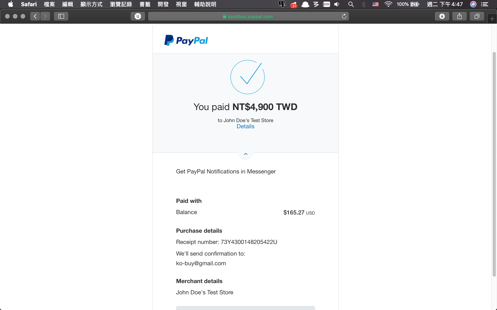
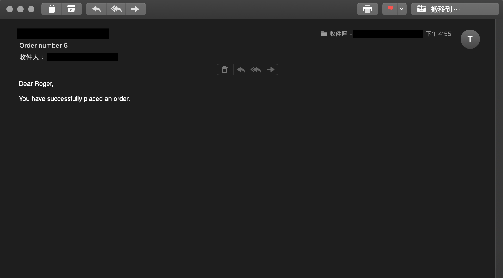

# BookStore

Django 的練習作品，一個販賣書籍的購物車網站。

使用 Django auth 建立使用者帳號，並擴充 customer 以及 vendor 兩種身份，盡量利用 Django 所提供的套件達成功能，比如註冊會員、查詢密碼等等。

使用者方面，確認購買項目之後透過 Django 發送使用者信箱確認帳單，並使用 PayPal 測試帳號模擬付款功能。

網站上線至 Heroku，使用 Heroku Postgres 當作後端資料庫。上線後使用 dotenv 讀取 .env 裡的敏感資訊，避免資料外洩。

PayPal 付款部分功能參考 https://github.com/twtrubiks/django-shop-tutorial

[Demo](https://shielded-sierra-95814.herokuapp.com)

* 左上角登入帳號。

* 使用測試帳號登入
  * 帳號 user
  * 密碼 defaultpasswd

* 將欲購買書籍加進購物車。

* 更改購買數量。

* 點選右下角前往結帳。

* 在帳單上填寫個人資訊，帳單建立之後會發送信件通知。

* 使用 PayPal 開發者帳號密碼登入付款
    * 開發者帳號 ko-buy@gmail.com
    * 開發者密碼 p^^!Gi4u

* 付款。

* 帳單成立後收到通知信件。

